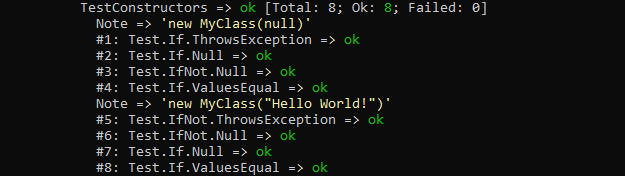
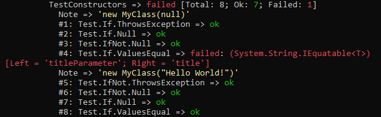
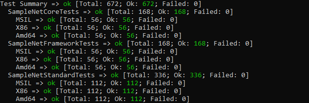
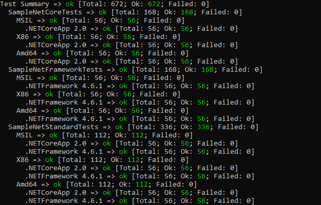
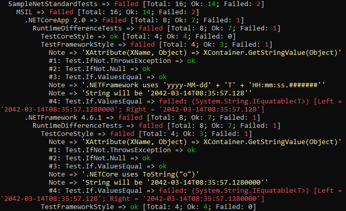

# Nuclear.Test
`Nuclear.Test` is a unit testing platform for `.NET` initially written some time in late 2012.
The main motivation behind it was curiosity and finding out how it can be done.
There have been many changes and improvements to it over the last years and I have used it to unit test my own projects ever since.

My own experience with the established unit testing platforms is very limited.
This has resulted in a very different concept of writing and running unit tests.
It may not be as refined and as solid as the others but it has done its job well so far.

By publishing this code I hope to help or inspire others to think outside the box and break new ground.

~~If~~ When you run into bugs and other problems, please open up an issue to help me fix it.

## Supported target frameworks
`Nuclear.Test` can run unit tests targeting the following frameworks.
Tests targeting `.NETStandard` will run on matching runtimes that implement the targeted version of `.NETStandard`.

* .NETFramework 4.6.1 or higher
* .NETCore 2.0 or higher
* .NETStandard 2.0 or higher

---

## Many tests per method
Methods and constructors can have multiple overloads and different input scenarios that need to be tested.
The call of a setter may change a secondary property under certain circumstances.
Some actions might raise an event that needs to be checked as well or may throw exceptions that need to be taken care of.

Test methods with any number of test instructions can do all that and more.
Even a failing test instruction will not abort the test and the following instructions will continue to be evaluated.

## Example:
```csharp
[TestMethod]
void TestConstructors() {

	MyClass obj = null;

	Test.Note("new MyClass(null)");
	Test.If.ThrowsException(() => obj = new MyClass(null), out ArgumentNullException ex);
	Test.If.Null(obj);
	Test.IfNot.Null(ex);
	Test.If.ValuesEqual(ex.ParamName, "title");

	Test.Note("new MyClass(\"Hello World!\")");
	Test.IfNot.ThrowsException(() => obj = new MyClass("Hello World!"), out ex);
	Test.IfNot.Null(obj);
	Test.If.Null(ex);
	Test.If.ValuesEqual(obj.Title, "Hello World!");

}
```

### Result (ok):


### Result (fail):


---

## Multiple test assemblies
Some projects are built against multiple target frameworks.
Others can require third party libraries that only exist in `x86` and `x64` so building against multiple processor architectures may be necessary.
It only makes sense to run the tests in all resulting output assemblies to make sure everything works as expected.

### Example:
```
...\src\publish\Nuclear.Test.Console>Nuclear.Test.Console.exe -d ../../../samples -i Debug;obj -v 1
```

### Result:


### Example:
```
...\src\publish\Nuclear.Test.Console>Nuclear.Test.Console.exe -d ../../../samples -i Debug;obj -v 2
```



---

## Multi runtime test execution
Projects targeting `.NETStandard` don't really have a platform to work with.
It is useful to run tests on a set of platforms that implement the specific version of `.NETStandard` since there are differences that could matter.

### Example:
```
...\src\publish\Nuclear.Test.Console>Nuclear.Test.Console.exe -d ../../../samples -i Debug;obj -v 3
```

### Result (ok):


### Example:
```csharp
class RuntimeDifferenceTests {

	[TestMethod]
	void TestCoreStyle() {

		DateTime someDate = new DateTime(2042, 3, 14, 8, 35, 57, 128);
		XAttribute xAttr = null;

		Test.Note("XAttribute(XName, Object) => XContainer.GetStringValue(Object)");
		Test.IfNot.ThrowsException(() => xAttr = new XAttribute(XName.Get("myAttribute"), someDate), out Exception ex);
		Test.IfNot.Null(xAttr);
		Test.If.ValuesEqual(xAttr.Name, "myAttribute");

		Test.Note(".NETCore uses ToString(\"o\")");
        // actually this is .NETCore 2.0 only.
        // .NETCore 2.1+ uses the .NETFramework style below.
		Test.Note("String will be '2042-03-14T08:35:57.1280000'");
		Test.If.ValuesEqual(xAttr.Value, "2042-03-14T08:35:57.1280000");

	}

	[TestMethod]
	void TestFrameworkStyle() {

		DateTime someDate = new DateTime(2042, 3, 14, 8, 35, 57, 128);
		XAttribute xAttr = null;

		Test.Note("XAttribute(XName, Object) => XContainer.GetStringValue(Object)");
		Test.IfNot.ThrowsException(() => xAttr = new XAttribute(XName.Get("myAttribute"), someDate), out Exception ex);
		Test.IfNot.Null(xAttr);
		Test.If.ValuesEqual(xAttr.Name, "myAttribute");

		Test.Note(".NETFramework uses 'yyyy-MM-dd' + 'T' + 'HH:mm:ss.#######'");
		Test.Note("String will be '2042-03-14T08:35:57.128'");
		Test.If.ValuesEqual(xAttr.Value, "2042-03-14T08:35:57.128");

	}

}
```

### Result (fail):


---

## Why you should (not) use Nuclear.Test
`Nuclear.Test` offers both advantages and disadvantages over other unit test platforms.
There are good reasons to use it or not.
This depends very much on your priorities and on which of the following two lists you feel more at home.

### Good reasons to use Nuclear.Test

* Unit testing functionality for .NETStandard libraries.
* Processor architecture independent (Any CPU, x86, x64).
* No more 'One assertion per test' rules. Test as much as you like.
* Don't know about you but using command line tools with colored output always makes me feel super smart.

### Good reasons to go with something else

* Requires to have no more than one test class per file where both need to have the exact same name.
* Command line only at the moment without any integration into Visual Studio.
* Not as sophisticated and will have bugs and stability issues which will take longer to fix.
* No community to help you with issues other than this place right here.

---

## Getting started
To get started quickly you can check out the tutorials on [How to write tests](docu/how_to_write_tests.md) and [How to run tests](docu/how_to_use.md) using `Nuclear.Test`.
Some of these tutorials make use of code in the [samples](samples) so you might want to load `samples/Samples.sln` in Visual Studio.
Building the samples from source may require you to execute `dotnet restore` and `NuGet restore` on the samples solution.

To execute your test assemblies you can either download the latest [release](https://github.com/MikeLimaSierra/Nuclear.Test/releases) or build the software from source.

A complete list of all available test instructions can be found [here](docu/test_instructions.md).

A detailed guide to writing test extensions and data driven tests can be found [here](docu/how_to_extend.md).

---

## Building from source
Building the software from source requires **Visual Studio 2017**.
Other versions might work as well but this is what I'm using so I suggest to use that.

1. In Visual Studio build the solution for all `release` configurations (`Any Cpu`, `x86` and `x64`). Do not use `Batch Build` as this will not currently work.
2. Execute `src/publish.bat` to publish all binaries to `src/publish/Nuclear.Test.Console/`.
3. Navigate to `src/publish/Nuclear.Test.Console/`.
4. Execute `Nuclear.Test.Console.exe` and configure with arguments (See [How to use Nuclear.Test](docu/how_to_use.md))

### Running tests on `samples/Samples.sln`
```
...\src\publish\Nuclear.Test.Console>Nuclear.Test.Console.exe -d ../../../samples -i Debug;obj
```

### Running tests on `src/Nuclear.Test.sln`
```
...\src\publish\Nuclear.Test.Console>Nuclear.Test.Console.exe -d ../../bin -i Debug;obj
```

---

## Roadmap
These features are planned for anytime in the future.
However this project is a one man show so things will be slow.

* Decent logging mechanism
* Installer packages
* WPF based test server with GUI
* Visual Studio integration
* MSBuild task

---
