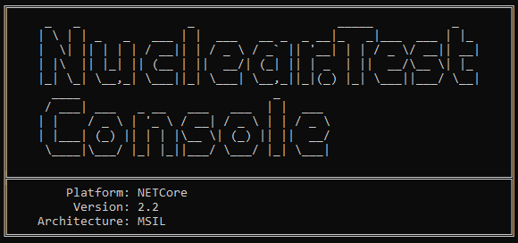
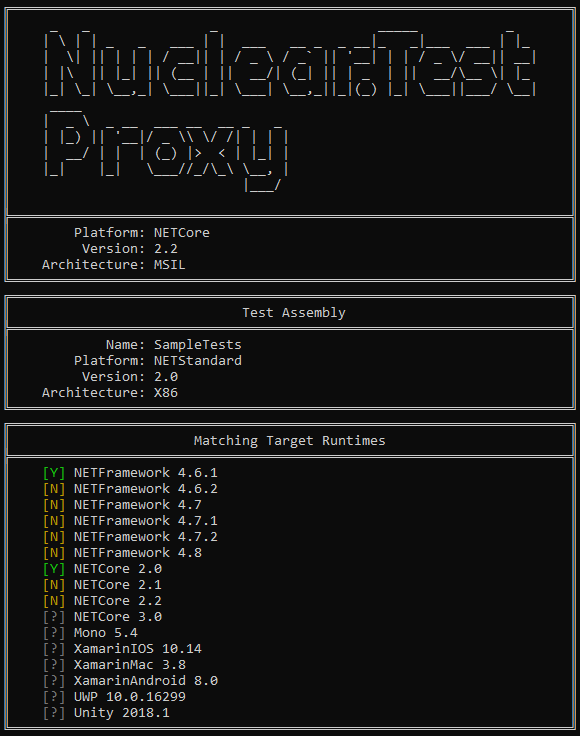
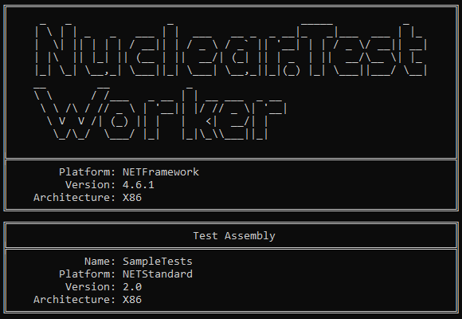

# How to use Nuclear.Test.Console

`Nuclear.Test.Console` is a command line tool used for running tests in one or more test assemblies.
`Nuclear.Test.Console` makes use of three different programs that can have visible windows.
Each program will therefore print a large visible header to help with orientation.
Test results are collected and printed to console when finished in every visible window.
Visibility of child processes can be configured (see below).

`Nuclear.Test.Console` will exit with `1` if there is one or more failed test instructions.
This can be used to automate unit testing in continuous integration (until there is full msbuild support).
If all tests are ok the exit code will be `0`.

## Table of contents

* [Configuration options](#configuration-options)
* [Running tests](#running-tests)
* [Nuclear.Test.Proxy](#nucleartestproxy)
* [Nuclear.Test.Worker](#nucleartestworker)

---

## Configuration options

`Nuclear.Test.Console` is configured by providing arguments with its call.
A list of available options is printed when calling the program without any arguments or by giving `-h` or `--help`

| Argument | Description |
|:--|:--|
| `-h`                           | Display this help context.
| `--help`                       | Same as `-h`.
| `-d path`                      | The directory to search for test assemblies in. Defaults to the current location.
| `--search-dir path`            | Same as `-d path`
| `-r num`                       | The depth of recursion to use for sub level directories. Defaults to `-r 0`  Use `0` to search all available sub directories recursively. Use `positive value` to search the first <num> levels of directories.
| `--search-recursion num`       | Same as `-r num`
| `-p pattern`                   | The search pattern to find files with. Defaults to `-p *Tests.dll`
| `--search-pattern pattern`     | Same as `-p pattern`
| `-i name1;name2;...`           | Ignore directories with these names separated by `;` .
| `--ignore-dir name1;name2;...` | Same as `-i name1;name2;...`
| `--force-sequential`           | Execute one test at a time for each assembly.
| `--force-asm-sequential`       | Execute one assembly at a time.
| `--test-all-versions`          | Execute tests on all matching runtimes.
| `--worker-base-dir path`       | The directory containing all worker executables. Defaults to `--worker-base-dir ./Nuclear.Test.Worker/`
| `--proxy-base-dir path`        | The directory containing all proxy executables. Defaults to `--proxy-base-dir ./Nuclear.Test.Proxy/`
| `--show-clients`               | Start client process as visible windows.
| `--clients-await-input`        | Let client process await key input before exit.
| `--diagnostic-output`          | Show diagnostic output.
| `-v num`                       | Set the minimum verbosity level for a 100% success case. Failing tests will unfold the relevant test tree nodes. Defaults to `-v 0` Use `0` to print all results combined. Use `1` to print results for individual test assemblies. Use `2` to print results for individual architectures. Use `3` to print results for individual runtime versions. Use `4` to print results for individual test classes. Use `5` to print results for individual test methods. Use `6` to print results for individual test instructions.
| `--verbose num`                | Same as `-v num`
  
---

## Running tests

Running unit tests using `Nuclear.Test.Console` is done by executing the command in a console.

---

## Nuclear.Test.Proxy

For every test assembly that is found according to the supplied configuration, `Nuclear.Test.Proxy` is started as a child process.
If the parameter `--show-clients` is provided, `Nuclear.Test.Proxy` will print out information about itself and the test assembly.
This will also give information about on what platform in what version the test assembly can be loaded.

By default the lowest possible version of any platform will be used to run tests on.
This can be configured by giving the argument `--test-all-versions` which will result in running tests on all matching runtimes.
* Runtimes marked with `[Y]` will be used.
* Runtimes marked with `[N]` will not be used.
* Runtimes marked with `[?]` do not have a worker.

---

## Nuclear.Test.Worker

For every matching `[Y]` marked runtime, `Nuclear.Test.Worker` is started as a child process.
If the parameter `--show-clients` is provided, `Nuclear.Test.Worker` will print out information about itself and the test assembly.

---
