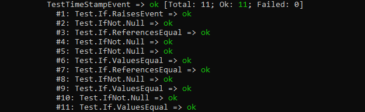
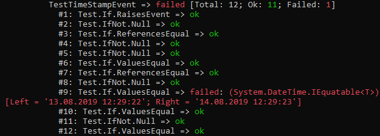
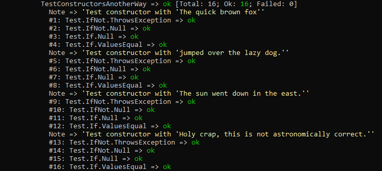

# How to write unit tests using `Nuclear.Test`
Writing unit tests using `Nuclear.Test` is very different from using other unit test platforms.
It doesn't matter how many things are tested in one test method.
The programmer can fully focus on writing exhaustive tests in a very compact format that is easy to read and understand.

## Setting up a test project
The first step in writing unit tests is to create a new project.
Ideally there is exactly one test project for every project that needs testing so that there are always a set of two assemblies with one containing only product code and the other containing only test code.
Both assemblies should target the same framework as this makes it a lot easier in the long run.
In the end `Nuclear.Test` will do the hard work of figuring out which runtime to use anyways.

By default, `Nuclear.Test.Console` will look for test assemblies with names matching `*tests.dll`.
It is a good idea to name the test project `MyFancyProductTests` if the product project is called `MyFancyProduct`.
It is also a good idea for the test project to use the same root namespace as the product project but this is just for convenience.

---

## Setting up a nuclear test site
Creating unit tests using `Nuclear.Test` requires to reference `Nuclear.TestSite`, available as a [NuGet package](https://www.nuget.org/packages/Nuclear.TestSite/) or [release](https://github.com/MikeLimaSierra/Nuclear.Test/releases).

---

## Test mode (parallel and sequential)
Both test classes and test methods have a test mode that can be configured.
A proper unit test is supposed to be fully independent of other unit tests.

Therefore `TestMode.Parallel` is the default in every case.
`TestMode.Sequential` will override that behaviour and will enforce sequential testing in its context no matter what.

It is not possible to enforce parallel testing upon a test class or test method that was configured for sequential testing.

Test methods configured for sequential testing will always be invoked first for every test assembly.
Test methods configured for parallel testing will always be invoked last.
There is no way of configuring the number of cpu cores to use in parallel testing.
The scheduler will decide what is best for the system and `Nuclear.Test` will act accordingly.

---

## Test classes
A class is a test class if it contains at least one test method or if it is decorated with the `Nuclear.TestSite.Attributes.TestClassAttribute`.
The attribute `[TestClass]` can be omitted in most cases.

If the entire class must be executed one test method at a time, the class can be decorated with `[TestClass(TestMode.Sequential)]`.

### Example:
```csharp
// this is a test class in parallel test mode
[TestClass]
class MyClassTests {
    // ...
}

// this is also a test class in parallel test mode
class MyClassTests {
    [TestMethod]
    void TestSomething() {
        // ...
    }
}

// this is a test class in sequential test mode
[TestClass(TestMode.Sequential)]
class MyClassTests {
    // ...
}
```


Please note that a test class must always be named like the file it lives in.
This is because every test instruction uses the file name to register test results.
Unhandled exceptions within a test method on the other hand will be registered to the class name.

### Example:
```csharp
// file MyClassTests.cs

// this is a test class with a bad name. test results in this class will be collected wrongly.
[TestClass]
class MyOtherClassTests {
    [TestMethod]
    void TestSomething() {
        FileInfo file = null;        
        
        // this test result will be registered to MyClassTests.TestSomething
        Test.If.True(true);
        // this test will cause an exception which will be registered to MyOtherClassTests.TestSomething
        Test.If.StringStartsWith(file.FullName, "file:///");
    }
}
```

---

## Test methods
A method is a test method if it is decorated with the `Nuclear.TestSite.Attributes.TestMethodAttribute`.
A method without `[TestClass]` will not be invoked by the test runner.

If the test method must be invoked sequentially, it can be decorated with `[TestMethod(TestMode.Sequential)]`.

### Example:
```csharp
// this is a test method in parallel test mode
[TestMethod]
void TestSomething() {
    // ...
}

// this is also a test method in parallel test mode
[TestMethod(TestMode.Parallel)]
void TestSomething() {
    // ...
}

// this is a test method in sequential test mode
[TestMethod(TestMode.Sequential)]
void TestSomething() {
    // ...
}
```

---

## Test instructions
While test classes are just containers for test methods, test methods are just containers for test instructions.
These are the actual tests and a test method without at least one test instruction will yield no results.

A test instruction can be called by accessing one of the two properties `If` and `IfNot` on the static class `Nuclear.TestSite.Tests.Test`.
Every test instruction generates exactly one test result according to its name and intellisense description.
The test result will be inverted if the instruction was called from `Test.IfNot`.

A more detailed description of all test instructions can be found [here](test_instructions.md)

### Example:
```csharp
[TestMethod]
void TestTimeStampEvent() {

	MyClass obj = new MyClass("asdf");
	XDocument doc = null;

	Test.If.RaisesEvent(obj, "TimeStampEvent", () => doc = obj.ToXml(), out Object sender, out MyCustomEventArgs e);

	Test.IfNot.Null(sender);
	Test.If.ReferencesEqual(sender, obj);

	Test.IfNot.Null(e);
	Test.IfNot.Null(e.XmlDoc);
	Test.If.ValuesEqual(e.XmlDoc, doc);
	Test.If.ReferencesEqual(e.XmlDoc, doc);
	Test.IfNot.Null(e.CallTimeStamp);
	Test.If.ValuesEqual(e.XmlDoc.Root.Attribute(XName.Get("calltimestamp")).Value, e.CallTimeStamp.ToString("o"));
	Test.IfNot.Null(e.WakeTimeStamp);
	Test.If.ValuesEqual(e.XmlDoc.Root.Attribute(XName.Get("waketimestamp")).Value, e.WakeTimeStamp.ToString("o"));

}
```

### Result:


There is no limit on the number of test instructions within a test method.
Even a failing instruction will not abort the test.
All subsequent instructions will be evaluated and logged.

### Example:
```csharp
[TestMethod]
void TestTimeStampEvent() {

	MyClass obj = new MyClass("asdf");
	XDocument doc = null;

	Test.If.RaisesEvent(obj, "TimeStampEvent", () => doc = obj.ToXml(), out Object sender, out MyCustomEventArgs e);

	Test.IfNot.Null(sender);
	Test.If.ReferencesEqual(sender, obj);

	Test.IfNot.Null(e);
	Test.IfNot.Null(e.XmlDoc);
	Test.If.ValuesEqual(e.XmlDoc, doc);
	Test.If.ReferencesEqual(e.XmlDoc, doc);
	Test.IfNot.Null(e.CallTimeStamp);
	Test.If.ValuesEqual(e.CallTimeStamp, DateTime.Now.AddDays(1)); // This line is obviously going to fail
	Test.If.ValuesEqual(e.XmlDoc.Root.Attribute(XName.Get("calltimestamp")).Value, e.CallTimeStamp.ToString("o"));
	Test.IfNot.Null(e.WakeTimeStamp);
	Test.If.ValuesEqual(e.XmlDoc.Root.Attribute(XName.Get("waketimestamp")).Value, e.WakeTimeStamp.ToString("o"));

}
```

### Result:


---

## Note
Complex test methods can contain many test instructions and figuring out the failing instruction can get very tiring.
Test notes can be added to fight excessive counting of lines.
A test note is a simple way of inserting a line of free text anywhere within the test instructions.

```csharp
public static void Note(String note);
```

### Parameters:
`String note`: The note that will be displayed.

### Example:
```csharp
[TestMethod]
void TestConstructorsAnotherWay() {
    Test.Note("Test constructor with 'The quick brown fox'");
    GenericTests.TestCtorGeneric("The quick brown fox");
    Test.Note("Test constructor with 'jumped over the lazy dog.'");
    GenericTests.TestCtorGeneric("jumped over the lazy dog.");

    Test.Note("Test constructor with 'The sun went down in the east.'");
    GenericTests.TestCtorGeneric("The sun went down in the east.");
    Test.Note("Test constructor with 'Holy crap, this is not astronomically correct.'");
    GenericTests.TestCtorGeneric("Holy crap, this is not astronomically correct.");
}
```

### Result:


---
